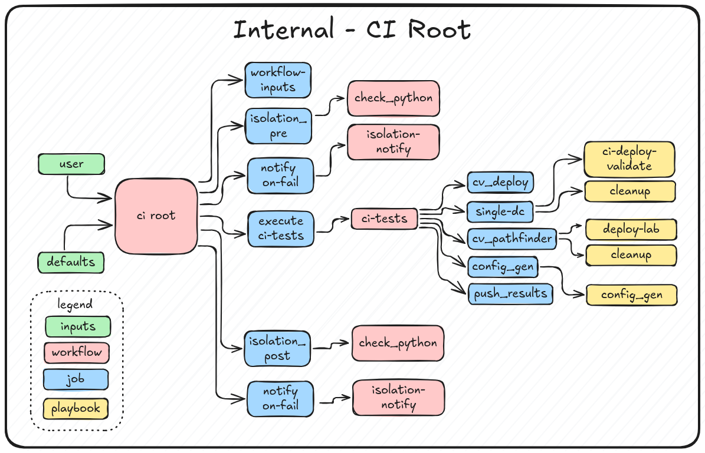
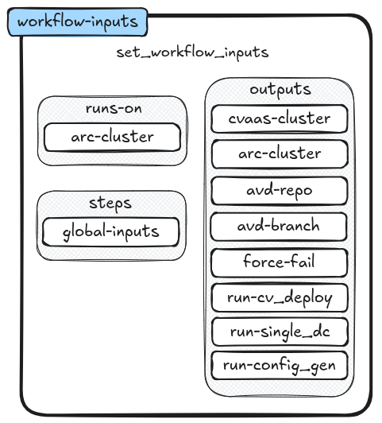

# Internal CI
### Overview


---
# Goal

Provide a Continuous Improvement and Continuous Deployment (CI/CD) infrastructure to test and validate new releases of software for the AVD project. 

---
# Components 

- Github Projects 
    - AVD
    - AVD-Internal
    - Solutions-Engineering-lab 
- Kubernetes Cluster
- EVE-NG Servers 

---
# Github Projects 
#### AVD 
- Software release to test
  - New releases 
  - Examples 

#### AVD-Internal 
- CI/CD Workflows

#### Solutions-Engineering-lab 
- Deploy kubernetes clusters 
- Test EVE-NG deployment


---



---
# Workflow Inputs

- The main purpose of this job is to set global variables for the workflow. 
- No additionnal workflows are trigered from this job 
- This job is a requirement for all the other jobs


---
# How to change theme 

Nice and dark. with emoji

```markdown
marp: true
author: Joel Breton
theme: default
class: invert
```

---

# To get free pictures

Use: 

- [Pexels](https://www.pexels.com)
- [Unsplash](https://unsplash.com)

